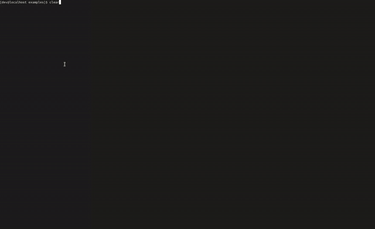

# Transak-client


### Examples

Inside directory `/examples` you can find full user flow example

#### The example contains:

1. Get price quotation.
2. Create order reservation.
3. Fill and submit User KYC Forms.
4. Fill and submit User Order Forms.
5. Get User data.
6. Place an Order.
7. Get the Order data.
8. Subscribe to websockets and get notification when order status is completed.


#### To run the example:
```npm run examples```

#### Terminal output sample:

